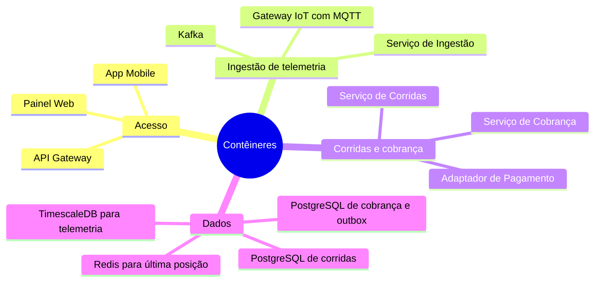

# C4 Nível 2 - Diagrama de Contêineres

```mermaid
mindmap
  root((Contêineres))
    Acesso
      App Mobile
      Painel Web
      API Gateway
    Ingestão de telemetria
      Gateway IoT com MQTT
      Kafka
      Serviço de Ingestão
    Corridas e cobrança
      Serviço de Corridas
      Serviço de Cobrança
      Adaptador de Pagamento
    Dados
      TimescaleDB para telemetria
      PostgreSQL de corridas
      PostgreSQL de cobrança e outbox
      Redis para última posição
```
