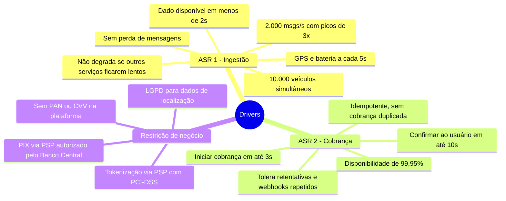

# Drivers

```mermaid
mindmap
  root((Drivers))
    ASR 1 - Ingestão
      10.000 veículos simultâneos
      GPS e bateria a cada 5s
      2.000 msgs/s com picos de 3x
      Dado disponível em menos de 2s
      Sem perda de mensagens
      Não degrada se outros serviços ficarem lentos
    ASR 2 - Cobrança
      Iniciar cobrança em até 3s
      Confirmar ao usuário em até 10s
      Idempotente, sem cobrança duplicada
      Tolera retentativas e webhooks repetidos
      Disponibilidade de 99,95%
    Restrição de negócio
      Sem PAN ou CVV na plataforma
      Tokenização via PSP com PCI-DSS
      PIX via PSP autorizado pelo Banco Central
      LGPD para dados de localização
```
